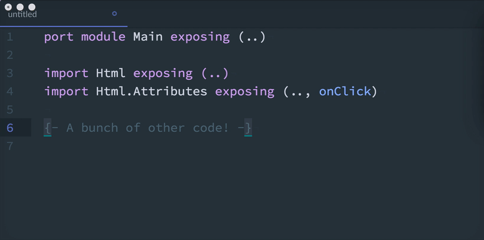

# elm-add-import package

Quickly add an import to your Elm file without scrolling up!

Default keybinding: `CMD-CTRL-I`

Note:

This is experimental and quickly developed for the sake of practicality. Currently importing specific type constructors is not supported (like `Foo.Bar exposing (Baz(Blah))`) but you can easily import all type constructors of a type by entering something like this in the text box: `Foo.Bar Baz(..)`
